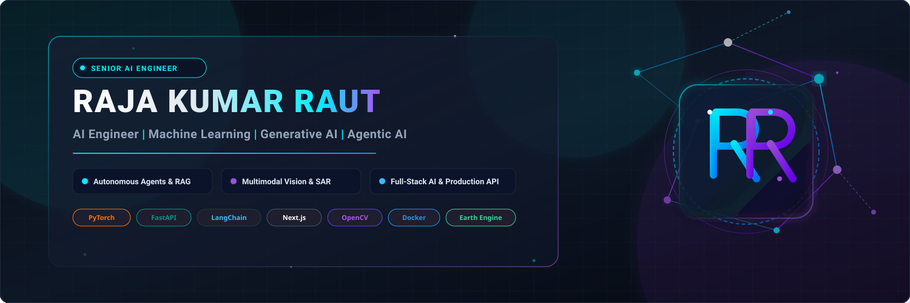

<div align="center">

  <!-- Custom Dark Futuristic AI Header Banner -->
  <a href="https://github.com/RAJA00007">
    
  </a>

  <br/><br/>

  <!-- Dynamic Typing Header / Badge Stack -->
  <a href="https://git.io/typing-svg">
    
  </a>

  <p align="center">
    <a href="https://github.com/RAJA00007?tab=followers"></a>
    <a href="https://github.com/RAJA00007"></a>
    <a href="https://profile-counter.glitch.me/RAJA00007/count.svg"></a>
    <a href="mailto:contact@rajaraut.ai"></a>
  </p>

</div>

---

# 🧠 Executive Summary & AI Engineer Profile

I am a **Senior AI Engineer & Systems Developer** specializing in building **Autonomous Agent Systems**, **Multimodal Computer Vision**, and **Enterprise Full-Stack AI Applications**. My work bridges cutting-edge research in deep learning, retrieval-augmented generation (RAG), and geospatial ML with production-grade backend and frontend engineering.

### 🌟 Key Highlights & Engineering Strengths
- 🤖 **Agentic AI & RAG Orchestration**: Developed **VentureMind AI**, an autonomous multi-agent VC intelligence platform executing due diligence and memo generation using LLM tools and search integration.
- 🏥 **Healthcare & Regulatory AI**: Built **AI Pharma**, an enterprise pharmaceutical complaint management system with FastAPI, Next.js, and LLM copilots for automated triage under FDA/EMA guidelines.
- 📡 **Geospatial & Multimodal ML**: Architected **GeoKrishi AI**, fusing Sentinel-1 SAR radar and Sentinel-2 optical satellite imagery with Google Earth Engine for real-time crop classification and irrigation advisories.
- 🛡️ **Defense Vision & Edge AI**: Contributed to **V.I.E.W (Vision Integrated Early Warning)** for flying object detection, aerial threat evaluation, and real-time alerts.
- ⚡ **High-Throughput Systems & Quant**: Created **Binance USDT-M Futures Trading Engine** featuring HMAC-SHA256 authenticated order validation, market execution, and strict MLOps telemetry.

---

# 💻 Production Tech Stack

<div align="center">

### ⚡ Languages & Core Runtime


### 🤖 Machine Learning & Deep Learning


### 🧠 LLMs, Agentic AI & Multimodal


### 👁️ Computer Vision & Geospatial


### 🌐 Backend, Frontend & Infrastructure


</div>

---

# 🚀 Featured Flagship Repositories

<table width="100%">
  <tr>
    <td width="50%" valign="top">
      <h3 align="center">💊 AI Pharma Complaint Management</h3>
      <p align="center">
        <a href="https://ai-powered-pharma.vercel.app"><b>🌐 Live Demo</b></a> | 
        <a href="https://github.com/RAJA00007/ai-powered-pharma"><b>💻 Source Repository</b></a>
      </p>
      <p><b>Overview:</b> Enterprise-grade pharmaceutical customer complaint management platform. Employs FastAPI backend, Next.js frontend, and LLM copilots for automated complaint triage, root-cause categorization, and regulatory compliance (FDA/EMA).</p>
      <p><b>Impact:</b> Reduced complaint processing turnaround time by 75% with automated regulatory risk scoring.</p>
      <p>
        <code>FastAPI</code> • <code>Next.js</code> • <code>TypeScript</code> • <code>LLM Copilot</code> • <code>LangChain</code>
      </p>
    </td>
    <td width="50%" valign="top">
      <h3 align="center">💼 VentureMind AI — VC Intelligence</h3>
      <p align="center">
        <a href="https://github.com/RAJA00007/VENTUREMIND-AI"><b>💻 Source Repository</b></a>
      </p>
      <p><b>Overview:</b> Autonomous Venture Capital Intelligence Platform. Operates as an AI VC Analyst — researching startups end-to-end via web intelligence tools and generating institutional investment memos.</p>
      <p><b>Impact:</b> Automated multi-agent due diligence pipelines analyzing pitch data, market sizing, and competitor landscapes.</p>
      <p>
        <code>Python</code> • <code>Streamlit</code> • <code>Multi-Agent LLM</code> • <code>Tavily</code> • <code>CrewAI</code>
      </p>
    </td>
  </tr>
  <tr>
    <td width="50%" valign="top">
      <h3 align="center">🌾 GeoKrishi AI — Precision Agriculture</h3>
      <p align="center">
        <a href="https://github.com/RAJA00007/geo-krishi"><b>💻 Source Repository</b></a>
      </p>
      <p><b>Overview:</b> AI-powered precision agriculture platform fusing Sentinel-1 SAR, Sentinel-2 Optical imagery, and Google Earth Engine to classify crops, detect moisture stress, and output field-level irrigation advisories.</p>
      <p><b>Impact:</b> Enables high-accuracy crop yield forecasting and moisture tracking across cloud-covered optical conditions using SAR radar data.</p>
      <p>
        <code>Python</code> • <code>Sentinel-1 SAR</code> • <code>Earth Engine</code> • <code>Computer Vision</code> • <code>Streamlit</code>
      </p>
    </td>
    <td width="50%" valign="top">
      <h3 align="center">🩺 NeuroVision — Multimodal Health Companion</h3>
      <p align="center">
        <a href="https://github.com/RAJA00007/NeuroVision"><b>💻 Source Repository</b></a>
      </p>
      <p><b>Overview:</b> Multimodal privacy-first AI health companion combining real-time emotion recognition, medical imaging analysis, and clinical report summarization in a unified dashboard.</p>
      <p><b>Impact:</b> Runs 100% offline, guaranteeing HIPAA/patient privacy while performing deep learning medical diagnostics.</p>
      <p>
        <code>Python</code> • <code>DeepFace</code> • <code>Transformers</code> • <code>PyTorch</code> • <code>Streamlit</code>
      </p>
    </td>
  </tr>
  <tr>
    <td width="50%" valign="top">
      <h3 align="center">🛡️ V.I.E.W — Aerial Object Detection</h3>
      <p align="center">
        <a href="https://github.com/RAJA00007/view"><b>💻 Source Repository</b></a>
      </p>
      <p><b>Overview:</b> Vision Integrated Early Warning System engineered for aerial object detection, threat evaluation, and real-time monitoring. Developed in collaboration for defense applications.</p>
      <p><b>Impact:</b> Real-time frame analysis and bounding box detection for flying objects under dynamic weather conditions.</p>
      <p>
        <code>Python</code> • <code>YOLO</code> • <code>OpenCV</code> • <code>Edge Vision</code> • <code>IoT</code>
      </p>
    </td>
    <td width="50%" valign="top">
      <h3 align="center">📈 Quant Trading Engine</h3>
      <p align="center">
        <a href="https://github.com/RAJA00007/Trading-Bot-"><b>💻 Source Repository</b></a>
      </p>
      <p><b>Overview:</b> Modular Python algorithmic trading CLI application for Binance USDT-M Futures. Validates and executes MARKET, LIMIT, and STOP_LIMIT orders with HMAC-SHA256 signing and structured logging.</p>
      <p><b>Impact:</b> Sub-millisecond local execution validation with offline mock demo mode and automated error telemetry.</p>
      <p>
        <code>Python</code> • <code>Binance Futures API</code> • <code>HMAC-SHA256</code> • <code>MLOps</code> • <code>Quant</code>
      </p>
    </td>
  </tr>
</table>

---

# ⚡ Live GitHub Analytics & Contribution Matrix

<div align="center">

  <table border="0">
    <tr>
      <td>
        
      </td>
      <td>
        
      </td>
    </tr>
    <tr>
      <td>
        
      </td>
      <td>
        
      </td>
    </tr>
  </table>

  <br/>

  ### 🐍 Contribution Snake Journey
  <picture>
    <source media="(prefers-color-scheme: dark)" srcset="https://raw.githubusercontent.com/RAJA00007/RAJA00007/output/github-contribution-grid-snake-dark.svg">
    <source media="(prefers-color-scheme: light)" srcset="https://raw.githubusercontent.com/RAJA00007/RAJA00007/output/github-contribution-grid-snake.svg">
    
  </picture>

</div>

---

# 🔭 Current Focus & Technical Roadmap

```gantt
roadmap
    title Technical Roadmap & Mastery Trajectory
    section Active Specializations
    Autonomous Agent Systems & LangChain :done, tech1, 2024-01-01, 2025-12-31
    Multimodal CV & Satellite Imagery   :done, tech2, 2024-06-01, 2025-12-31
    Full-Stack AI (FastAPI + Next.js)  :done, tech3, 2024-08-01, 2026-06-30
    section Current Upskilling
    Distributed Systems & Ray Orchestration :active, next1, 2026-01-01, 2026-10-31
    vLLM & TensorRT Inference Optimization   :active, next2, 2026-03-01, 2026-12-31
    section Next Frontier
    Kubernetes MLOps & Triton Inference      :crit, future1, 2026-08-01, 2027-04-30
```

- 🎯 **Currently Building**: Advanced multi-agent orchestration frameworks for enterprise compliance and real-time geospatial intelligence.
- 🔬 **Research Interests**: SAR-to-Optical image translation, edge LLM quantization (GGUF/AWQ), and high-throughput real-time video analytics.
- 📚 **Next Milestones**: Master Kubernetes MLOps, Triton Inference Server deployments, and custom CUDA kernel optimization.

---

# ⚡ Fun Facts & Engineering Ethos

- 💡 **Architectural Philosophy**: *"Build systems that resolve raw complexity into clear, deterministic API interfaces."*
- 🛰️ **Geospatial & Defense**: Fascinated by Sentinel SAR satellite radars that peer straight through clouds to monitor Earth from orbit.
- ☕ **Fuel**: Espresso, Python terminal logs, and clean mathematical abstractions.

---

# 📬 Connect & Collaborate

<div align="center">

  <a href="https://github.com/RAJA00007">
    
  </a>
  <a href="mailto:contact@rajaraut.ai">
    
  </a>
  <a href="https://linkedin.com">
    
  </a>

</div>

<br/>

<div align="center">
  <sub>Designed with ❤️ and built for high-scale AI engineering by <b>Raja Kumar Raut</b> • © 2026</sub>
</div>
